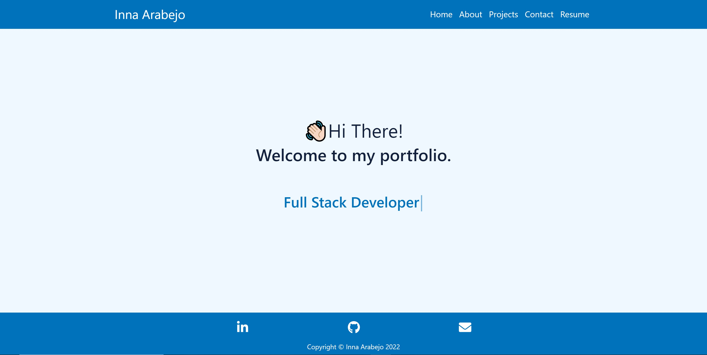
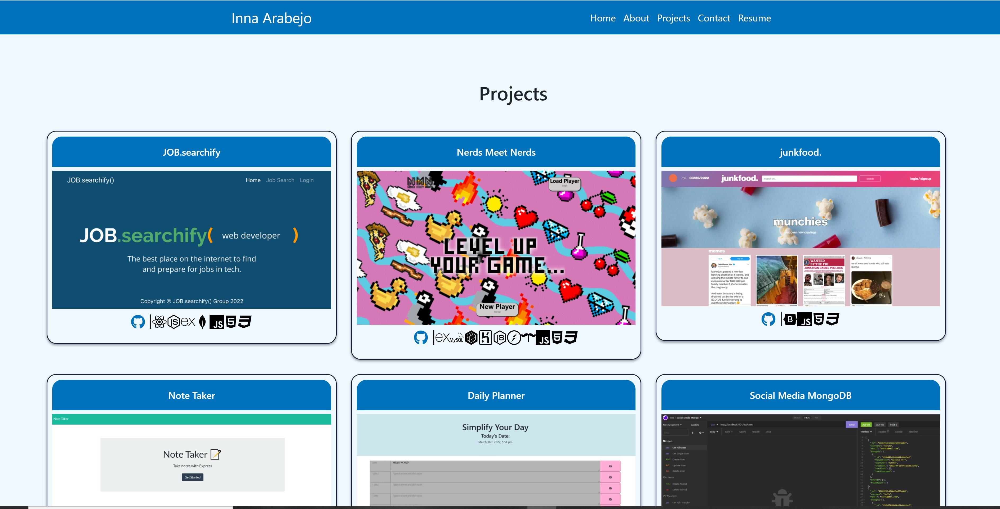
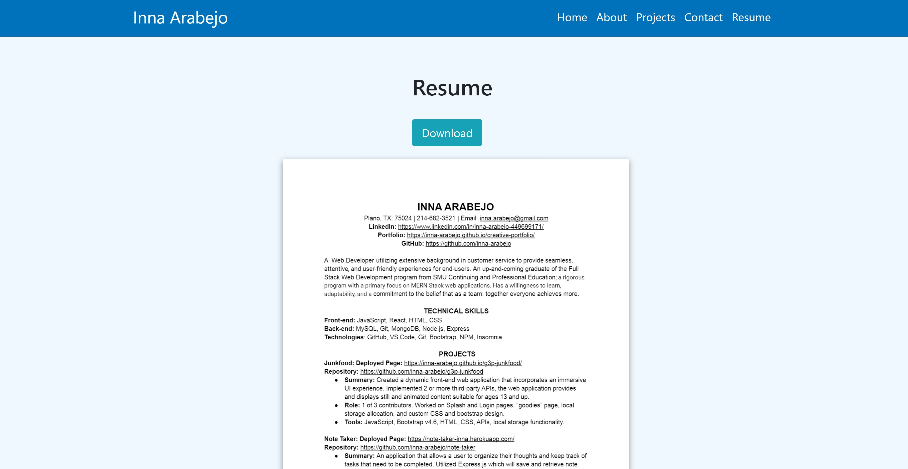

# Creative Portfolio: React

This project was bootstrapped with [Create React App](https://github.com/facebook/create-react-app).

## Objectives 
A dynamic react portfolio that showcases who I am as a web-developer. It includes an about-me, projects I've created, contact form, and resume. 

## Table of Contents
1. [Installation](#installation)
2. [Steps to Install](#steps-to-install)
3. [Main Features](#main-features)
4. [Deployed Page](#deployed-page)
5. [Screenshots](#screenshots)
6. [Technologies Used](#technologies-used)
7. [License](#license)

## Installation
The following dependencies were installed to run the application. 
* [react-pdf](https://www.npmjs.com/package/react-pdf)

## Steps to Install
This application should be hosted locally via github pages. However, if the application is no longer running, or you just wish to run it locally, you can follow these instructions:

#### Step 1

Download or Clone this repo:
You can either download the repo as a zip file and unzip it to your computer, or you can clone it down to your computer directly.

#### Step 2

Navigate to App Directory:
Make sure you are in the directory of the application. It should be a folder named creative-portfolio-react. 

#### Step 3

Install Dependencies:
While you are located in the app directory, enter 'npm install'. This should cause the application to find and install all necessary dependencies.

#### Step 4

Start the application:
Open the terminal by right-clicking the `src` folder, then in the command line, enter 'npm start'. As long as there are no errors, this should run the app via http://localhost:3000 to view it in your browser.

## Main Features

- About me page that includes a list of skills.
- Projects I've created.
- Contact form to contact me.
- Image of resume which can be downloaded.

## Deployed Page
[Creative React Portfolio](https://inna-arabejo.github.io/creative-portfolio-react/)

## Screenshots

## Technologies Used
React, Node.js, HTML, CSS, JS, Bootstrap

## License
This project is covered under MIT.

------------------------------------
## Available Scripts

In the project directory, you can run:

### `npm start`

Runs the app in the development mode.\
Open [http://localhost:3000](http://localhost:3000) to view it in your browser.

The page will reload when you make changes.\
You may also see any lint errors in the console.

### `npm test`

Launches the test runner in the interactive watch mode.\
See the section about [running tests](https://facebook.github.io/create-react-app/docs/running-tests) for more information.

### `npm run build`

Builds the app for production to the `build` folder.\
It correctly bundles React in production mode and optimizes the build for the best performance.

The build is minified and the filenames include the hashes.\
Your app is ready to be deployed!

See the section about [deployment](https://facebook.github.io/create-react-app/docs/deployment) for more information.

### `npm run eject`

**Note: this is a one-way operation. Once you `eject`, you can't go back!**

If you aren't satisfied with the build tool and configuration choices, you can `eject` at any time. This command will remove the single build dependency from your project.

Instead, it will copy all the configuration files and the transitive dependencies (webpack, Babel, ESLint, etc) right into your project so you have full control over them. All of the commands except `eject` will still work, but they will point to the copied scripts so you can tweak them. At this point you're on your own.

You don't have to ever use `eject`. The curated feature set is suitable for small and middle deployments, and you shouldn't feel obligated to use this feature. However we understand that this tool wouldn't be useful if you couldn't customize it when you are ready for it.

## Learn More

You can learn more in the [Create React App documentation](https://facebook.github.io/create-react-app/docs/getting-started).

To learn React, check out the [React documentation](https://reactjs.org/).

### Code Splitting

This section has moved here: [https://facebook.github.io/create-react-app/docs/code-splitting](https://facebook.github.io/create-react-app/docs/code-splitting)

### Analyzing the Bundle Size

This section has moved here: [https://facebook.github.io/create-react-app/docs/analyzing-the-bundle-size](https://facebook.github.io/create-react-app/docs/analyzing-the-bundle-size)

### Making a Progressive Web App

This section has moved here: [https://facebook.github.io/create-react-app/docs/making-a-progressive-web-app](https://facebook.github.io/create-react-app/docs/making-a-progressive-web-app)

### Advanced Configuration

This section has moved here: [https://facebook.github.io/create-react-app/docs/advanced-configuration](https://facebook.github.io/create-react-app/docs/advanced-configuration)

### Deployment

This section has moved here: [https://facebook.github.io/create-react-app/docs/deployment](https://facebook.github.io/create-react-app/docs/deployment)

### `npm run build` fails to minify

This section has moved here: [https://facebook.github.io/create-react-app/docs/troubleshooting#npm-run-build-fails-to-minify](https://facebook.github.io/create-react-app/docs/troubleshooting#npm-run-build-fails-to-minify)
